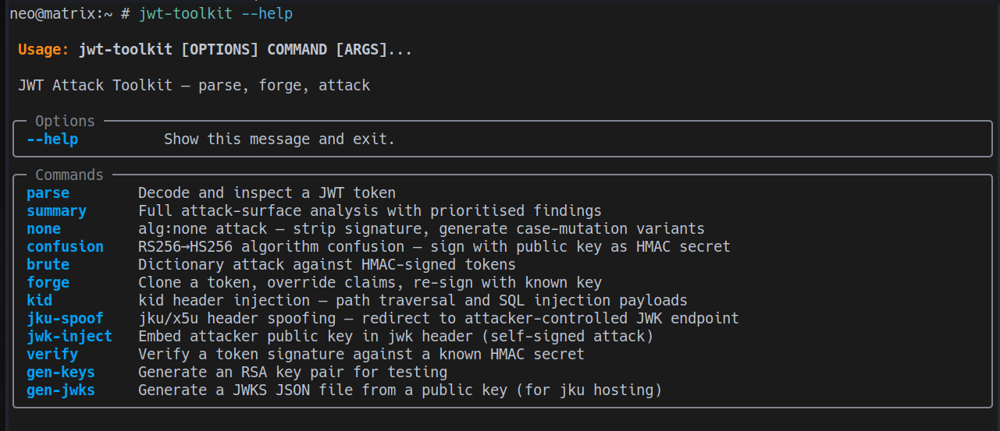
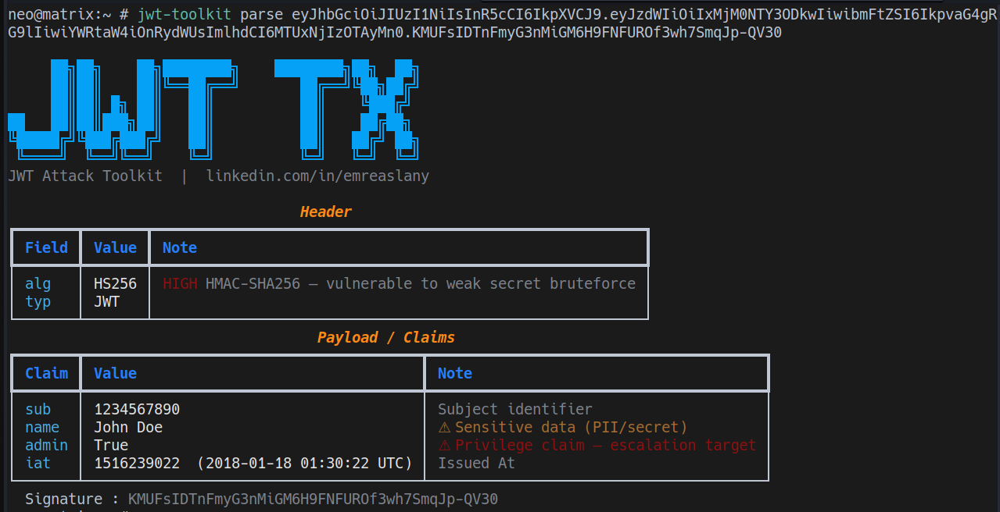
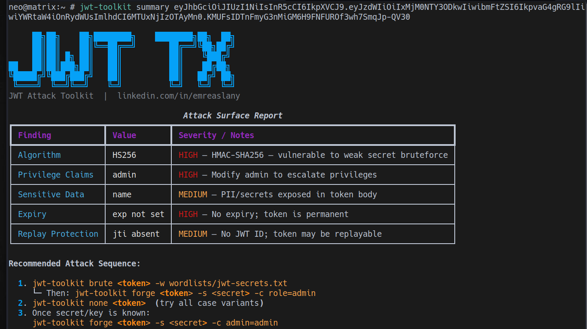
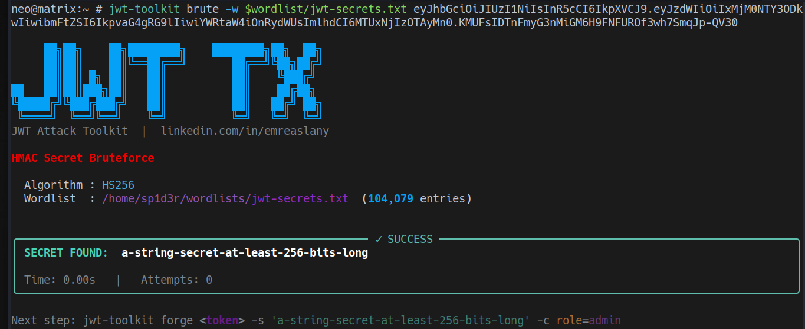
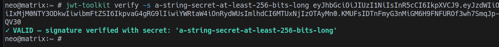

# JWT Toolkit

A focused command-line toolkit for JSON Web Token (JWT) security assessment workflows.

`jwt-toolkit` helps security engineers and testers inspect tokens, assess attack surface, validate signing behavior, and reproduce common JWT vulnerability scenarios in controlled environments.

## Highlights

- Structured JWT inspection (`parse`)
- Prioritized attack-surface analysis (`summary`)
- `alg:none` downgrade variant generation (`none`)
- RS256 -> HS256 algorithm confusion testing (`confusion`)
- HMAC secret dictionary attack (`brute`)
- Token forging with claim overrides (`forge`)
- `kid` header injection payload crafting (`kid`)
- `jku/x5u` spoofing flow support (`jku-spoof`)
- Embedded JWK self-signed token generation (`jwk-inject`)
- HMAC signature verification (`verify`)
- RSA keypair and JWKS generation (`gen-keys`, `gen-jwks`)

## Requirements

- Python 3.10+

## Installation

```bash
pip install -e .
```

Verify installation:

```bash
jwt-toolkit --help
```

## Quick Start

```bash
# Inspect token structure and claims
jwt-toolkit parse <JWT>

# Generate a prioritized security summary
jwt-toolkit summary <JWT>

# Attempt HMAC secret recovery
jwt-toolkit brute <JWT> -w wordlists/jwt-secrets.txt

# Forge a token after recovering a valid secret
jwt-toolkit forge <JWT> -s <SECRET> -c role=admin

# Validate token signature with a known secret
jwt-toolkit verify <JWT> -s <SECRET>
```

## Command Reference

- `parse` - Decode header/payload and annotate findings.
- `summary` - Produce a prioritized attack-surface report with recommended next steps.
- `none` - Generate multiple `alg:none` token variants.
- `confusion` - Build RS256->HS256 confusion payloads using a public key as HMAC material.
- `brute` - Run dictionary-based secret discovery for HS256/384/512 tokens.
- `forge` - Re-sign a token with claim overrides via HMAC or RSA.
- `kid` - Craft tokens with injected `kid` payloads.
- `jku-spoof` - Generate tokens pointing to attacker-controlled key URLs.
- `jwk-inject` - Embed a JWK in header and sign with matching private key.
- `verify` - Verify HMAC signatures against candidate secrets.
- `gen-keys` - Generate RSA key pairs.
- `gen-jwks` - Convert an RSA public key into JWKS format.

## Screenshots

### CLI Help



### Token Parsing Output



### Attack Surface Summary



### Bruteforce Success Example



### Signature Verification



## Responsible Use

This toolkit is intended for authorized security testing, research, and training.

Do not use it against systems, applications, or data without explicit permission.
